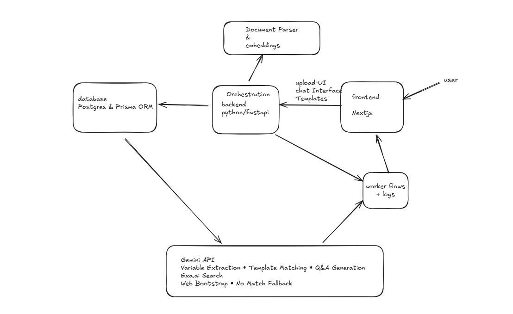

# Lexi - Frontend

## System Architecture

### Core Components

1. **Frontend** (Next.js)
   - Modern, responsive web application
   - User interface for document management
   - Real-time chat interface for document interactions
   - Built with Shadcn Next.js, and Tailwind CSS

2. **Orchestration Backend** (Python/FastAPI)
   - Central coordination layer
   - RESTful API endpoints
   - Workflow management and business logic
   - Integration hub for all services

3. **Database** (PostgreSQL & Prisma ORM)
   - Template storage and management
   - Document metadata and versioning
   - User data and preferences
   - Query optimization via Prisma ORM

4. **Document Parser & Embeddings**
   - Multi-format document processing (.docx, .pdf, .txt)
   - Text extraction and normalization
   - Document chunking and preprocessing
   - Drafting 

5. **Gemini API Layer**
   - Variable extraction from documents
   - Template matching and suggestions
   - Q&A generation for document clarification
   - Exa.ai search integration for web content
   - Web bootstrap for template creation
   - No-match fallback handling

### Step 1: Clone the Repository

```bash
git clone https://github.com/Praxxav/lexi-frontend.git
cd lexi-frontend
```

### Step 2: Install Dependencies

Install the necessary Node.js packages using `yarn` or `npm`.


```bash
npm install
npm run dev
`

& application is running on port 3000.